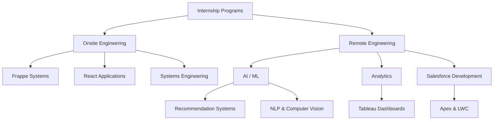
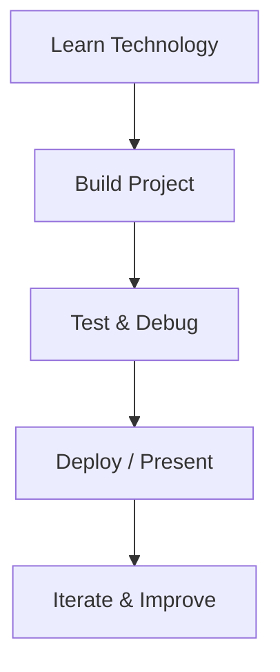

<div align="center">

<br/>

```txt
██╗███╗   ██╗████████╗███████╗██████╗ ███╗   ██╗
██║████╗  ██║╚══██╔══╝██╔════╝██╔══██╗████╗  ██║
██║██╔██╗ ██║   ██║   █████╗  ██████╔╝██╔██╗ ██║
██║██║╚██╗██║   ██║   ██╔══╝  ██╔══██╗██║╚██╗██║
██║██║ ╚████║   ██║   ███████╗██║  ██║██║ ╚████║
╚═╝╚═╝  ╚═══╝   ╚═╝   ╚══════╝╚═╝  ╚═╝╚═╝  ╚═══╝
```

```txt
██╗    ██╗ ██████╗ ██████╗ ██╗  ██╗
██║    ██║██╔═══██╗██╔══██╗██║ ██╔╝
██║ █╗ ██║██║   ██║██████╔╝█████╔╝
██║███╗██║██║   ██║██╔══██╗██╔═██╗
╚███╔███╔╝╚██████╔╝██║  ██║██║  ██╗
 ╚══╝╚══╝  ╚═════╝ ╚═╝  ╚═╝╚═╝  ╚═╝
```

### Internship Engineering Archive

<br/>

[](#)
[](#)
[](#)
[](#)

<br/>

> **Build · Learn · Ship · Iterate**

> Centralized archive of internship engineering work spanning onsite and remote programs across full stack systems, AI/ML, analytics, Salesforce development, and platform engineering.

<br/>

[Onsite Internship](#-onsite-internship) •
[Remote Internship](#-remote-internship) •
[Skills](#-key-skills-demonstrated) •
[Organizations](#-internship-organizations)

---

</div>

# 📘 Overview

> [!NOTE]
> This repository acts as a centralized engineering archive documenting internship work completed across onsite and remote internship programs.

The archive includes:
- full stack application development
- systems engineering practice
- AI/ML experimentation
- analytics dashboards
- Salesforce development
- backend architecture work
- frontend engineering projects
- deployment and debugging workflows

---

# 🧠 Engineering Focus

<table>
<tr>

<td width="33%" valign="top">

## ⚙️ Full Stack Systems

- React applications
- Frappe Framework
- Redux Toolkit
- REST APIs
- JWT authentication
- Backend integrations

</td>

<td width="33%" valign="top">

## 🤖 AI / ML

- Recommendation systems
- NLP experimentation
- Computer vision
- Deep learning workflows
- Clustering algorithms
- Model experimentation

</td>

<td width="33%" valign="top">

## ☁️ Platform Engineering

- Docker workflows
- Shell scripting
- Salesforce development
- Tableau analytics
- Systems engineering
- Deployment practice

</td>

</tr>
</table>

---

# 🏢 Internship Organizations

> [!NOTE]
> Engineering work completed across onsite and remote internship programs involving full stack systems, AI/ML experimentation, analytics, and platform engineering.

<br/>

<div align="center">

<table>
<tr>

<td align="center" width="100%">

<a href="https://in.linkedin.com/company/inkersai">


### Inkers Technology Pvt. Ltd.
</a>

`Onsite Internship`
`Systems Engineering`
`Full Stack Development`

📍 HSR Layout, Bengaluru  
📅 Dec 2025 – Feb 2026

💻 ⚙️ 🚀

</td>

</tr>
</table>

</div>

---

# 🏢 Onsite Internship

> [!IMPORTANT]
> Work completed during the offline internship at:
>
> **Inkers Technology Pvt. Ltd.**
>
> 📍 HSR Layout, Bengaluru  
> 📅 Dec 2025 – Feb 2026

---

# 📂 Engineering Projects

<table>
<tr>
<th>Project</th>
<th>Description</th>
<th>Primary Stack</th>
</tr>

<tr>
<td><strong>frappe-role-based-access-system</strong></td>
<td>Complete RBAC system built using Frappe Framework with React frontend, whitelisted APIs, and permission-based workflows.</td>
<td>Frappe · React · Python</td>
</tr>

<tr>
<td><strong>Systems-Engineering-Practice</strong></td>
<td>Systems engineering practice repository covering Docker, shell scripting, React workflows, JavaScript experimentation, and assignment submissions.</td>
<td>Docker · Bash · React</td>
</tr>

<tr>
<td><strong>Task-Management-RTK</strong></td>
<td>Task management application built using Redux Toolkit and RTK Query for scalable frontend state management workflows.</td>
<td>React · Redux Toolkit</td>
</tr>

<tr>
<td><strong>Task-Manager-Frappe-React</strong></td>
<td>Full stack task management platform integrating Frappe backend services with React frontend architecture.</td>
<td>Frappe · React · APIs</td>
</tr>

</table>

---

# 🌐 Remote Internship

> [!NOTE]
> Work completed during remote internship programs across multiple organizations and engineering initiatives.

---

# 📂 Engineering Projects

<table>
<tr>
<th>Project</th>
<th>Description</th>
<th>Primary Stack</th>
</tr>

<tr>
<td><strong>aiml-sit2025</strong></td>
<td>AI/ML assignments and experimentation projects completed under the SIT2025 program.</td>
<td>Python · Machine Learning</td>
</tr>

<tr>
<td><strong>anime-recommendation</strong></td>
<td>Unsupervised anime recommendation system using clustering techniques and content-based recommendation workflows.</td>
<td>Python · K-Means</td>
</tr>

<tr>
<td><strong>cosmetic-insights-tableau</strong></td>
<td>Data analytics and visualization project focused on cosmetics industry trends using Tableau dashboards.</td>
<td>Tableau · Analytics</td>
</tr>

<tr>
<td><strong>genz-educatewing</strong></td>
<td>NLP and computer vision experimentation projects using deep learning workflows and model training pipelines.</td>
<td>Deep Learning · NLP</td>
</tr>

<tr>
<td><strong>carbon-footprint-tracker</strong></td>
<td>Salesforce CRM solution for organizational carbon emission tracking and sustainability reporting workflows.</td>
<td>Salesforce · Apex · LWC</td>
</tr>

<tr>
<td><strong>skilldzire-java</strong></td>
<td>Full stack Java projects including JWT authentication systems and student management platforms.</td>
<td>Java · Spring Boot</td>
</tr>

</table>

---

# 🏗️ Internship Learning Architecture



---

# ⚡ Engineering Workflow



---

# 🧩 Key Skills Demonstrated

<div align="center">

| Domain | Technologies |
|---|---|
| **Full Stack Development** | React · Redux Toolkit · Flask · Spring Boot |
| **Backend Engineering** | Frappe Framework · Python · APIs · JWT |
| **Systems Engineering** | Docker · Bash · Linux Workflows |
| **AI / ML** | Python · NLP · Deep Learning · K-Means |
| **Data Analytics** | Tableau · Visualization · Data Cleaning |
| **Salesforce Development** | Apex · LWC · CRM Workflows |

</div>

---

# 📚 Engineering Areas Explored

<div align="center">

<table>
<tr>

<td width="50%" valign="top" align="left">

## 💻 Software Engineering

- Frontend architecture
- Backend APIs
- Authentication systems
- Role-based access control
- State management
- Full stack integration

</td>

<td width="50%" valign="top" align="left">

## 🔬 Technical Exploration

- AI/ML experimentation
- Analytics workflows
- Distributed systems concepts
- Dockerized development
- CRM engineering
- Deployment pipelines

</td>

</tr>
</table>

</div>

---

# 🧠 Engineering Principles

> [!TIP]
> The goal across all internship programs was not just completing assignments, but understanding how production engineering systems are designed, integrated, deployed, and maintained.

Key principles followed:
- modular engineering
- practical implementation
- architecture-focused learning
- iterative improvement
- deployment awareness
- debugging-first workflows
- engineering-oriented experimentation

---

# 🚀 Internship Outcomes

> [!IMPORTANT]
> These internship programs collectively strengthened:
>
> - full stack engineering workflows
> - backend system understanding
> - frontend architecture skills
> - AI/ML experimentation capability
> - systems engineering fundamentals
> - deployment and debugging practices
> - production-oriented development thinking

---

<div align="center">

<br/>

**Built through hands-on internship engineering experience**

<br/>

*Full Stack · Systems · AI/ML · Analytics · Salesforce*

<br/>

</div>
